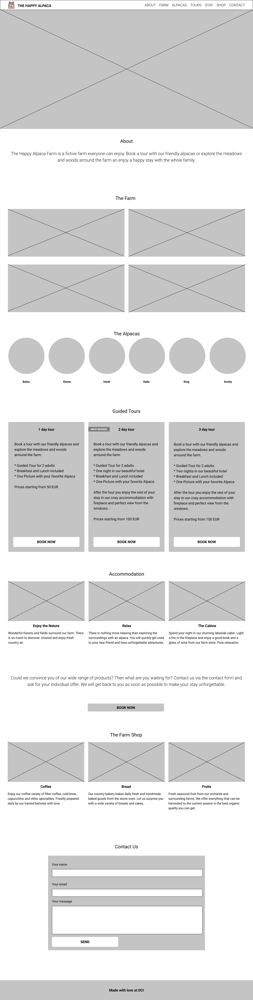

# UIB Portfolio Project

---

### Zielsetzung

Entwerfe und erstelle eine persönliche Portfolio Webseite, die akkurat deine Errungenschaften, Fähigkeiten und deine Erfahrung wiedergibt. 
Dieses Portfolio ist als erste Vorstellung gegenüber einem möglichen Arbeitgeber anzusehen bzw. als digitale Visitenkarte.
Arbeitgeber und oder Arbeitsvermittler suchen nach Fähigkeiten und Professionalität, weshalb es selbstverständlich ist, dass dieses Portfolio von irrelevanter Information und Inhalt unterhaltenden Charakters absehen sollte. Also eben alles, was von einer Bewertung der "Einstellbarkeit" ablenkt.

Nutze diese Möglichkeit um ein sauberes, ansprechendes Portfolio zu kreieren, das deine Kompetenzen bestmöglich widerspiegelt. Halte es eher schlicht, direkt und hilfreich.

### Anforderungen
- Entwerfe, erstelle und lade deine eigene professionelle Webseite hoch - demonstriere dabei deine Kompetenz in allen Fähigkeiten, die du dir bisher erarbeitet hast.

- Nutze bitte nur HTML und CSS - du kannst dein Portfolio jederzeit nach Abschluss des Projekts um Techniken erweitern, die du möchtest.

- Die Webseite soll Full Responsive und so zugänglich wie möglich sein.

- Wende dein Wissen aus dem Bereich UI/UX so gut wie möglich an.

- Vor der Erstellung jeglichen Codes, solltest deine Arbeitsumgebung und Planung erstellen. Dazu zählen:
    - Die saubere Ordnerstruktur
    - Ein Github Repository, in das du deine Arbeit hochlädst
    - Wireframes (Für Desktop und Mobil)
    - Deine gewählte Farbpalette
    - Möglicherweise auch schon gewählte Bilder

- Lasse dein Portfolio von jemand anderem aus dem Kurs korrekturlesen. (Ihr dürft euch auch gerne inhaltliche Tipps geben)
- Arbeite selbstständig ohne dauerhafte Hilfe anderer Kursteilnehmer_innen, es ist immerhin DEINE Arbeit.
- Als Tipp: Auch wenn gute Beispiele für Portfolios bekannt sind, darfst und sollst du gerne kreativ werden.

### Folgendes sollte enthalten sein:

- Ein Profilbild (optional)
- Kontakt Information
- Funktionierende Links zu **relevanten** Social-Media Accounts (GitHub, evtl. LinkedIn)
- Eine Präsentation von mindestens drei abgeschlossenen Projekten. Nutzt dafür z.B. eure abgeschlossenen Übungen oder auch die Hardcode-Homepage mit dem Teil, den du bearbeitet hast.
- Eine kurze Vorstellung und Beschreibung des persönlichen Leitbilds.
- Eine README mit einer kleinen Beschreibung des Projekts und deines Vorgehens. Beschreibe darin deine Design Entscheidungen und beantworte außerdem noch kurz und bündig folgende drei Fragen:
    - Was ist mir besonders gut gelungen?
    - Womit hatte ich besondere Schwierigkeiten?
    - Wie würde ich die Seite in Zukunft erweitern wollen?

- Füge zusätzlich deine Wireframes als Bilder (gerne mit Anmerkungen) und deine Farbpalette in die Beschreibung ein.
Das könnte z.B. so aussehen:

### Folgendes sollte NICHT im Portfolio enthalten sein:

- Links zu persönlichen Social-Media Accounts
- Politischee und oder religiöse Inhalte
- Denk dran, es handelt sich um ein öffentliches Portfolio. Vermeide also die Nutzung von albernen Fotos, lustigen Memes, Gamer Tags, etc.
- Jegliche persönliche Information oder Meinungen, die nichts mit dir als professioneller/m und einstellbarer/m Web Entwickler_in zu tun haben.

### Präsentation

Am Ende des Projekts wirst du dein Portfolio-Projekt der Klasse vorstellen.
Konzentriere dich dabei auf die Erklärung des Inhalts, deiner Design Entscheidungen, des Workflows und gehe auf Schwierigkeiten sowie Erfolge ein.
Bereite dich wirklich auf die Präsentation vor und überlege dir was du sagen willst und wie du es präsentierst (Vielleicht sind ja ein paar Folien eine gute Idee).

Natürlich solltest du alles geben, um die Webseite rechtzeitig fertig zu stellen. Sollte dir dies allerdings nicht gelingen, sollst du diese trotzdem präsentieren als Work in Progress (WIP).

Deine Klassenkamerad_innen und Lehrer werden Fragen zum Projekt stellen sowie KONSTRUKTIVES Feedback geben.

Betrachte diese Präsentation als eine Möglichkeit, deine Arbeit so vorzustellen als würdest du es in einem professionellen Kontext tun (z.B. Einstellungsgespräch).
Deine Kommunikationsskills sind also wichtig!

Denke daran, es ist kein Wettbewerb, wir möchten uns alle gegenseitig helfen und unterstützen.

#### Hilfreiche Links

- [20 gute Beispiele für Portfolio Designs](https://www.shopify.de/partners/blog/20-webdesign-portfolios-inspiration)
- [Entwickler Portfolios zur Inspiration](https://www.freecodecamp.org/news/15-web-developer-portfolios-to-inspire-you-137fb1743cae/)
- [35 Web Entwickler Portfolio Beispiele](https://skillcrush.com/blog/web-developer-portfolios/)
- [Mehr Portfolio Beispiele](https://www.sliderrevolution.com/design/web-developer-portfolio-examples/)
- [Ein gutes deutsches Portfolio Beispiel](https://www.dein-webentwickler.de/)
- [Die Anatomie einer perfekten Portfolio-Website zur Präsentation deiner Arbeit](https://kinsta.com/de/blog/portfolio-website/)
- [How to Build a Stunning Portfolio](https://www.sitepoint.com/how-to-build-a-stunning-portfolio-website-as-a-web-developer/)
- [How to Build a Web Developer Portfolio](https://brainstation.io/career-guides/how-to-build-a-web-developer-portfolio)
- [A Comprehensive Website Planning Guide](https://www.smashingmagazine.com/2018/02/comprehensive-website-planning-guide-part1/)
- [Portfolio Tips](https://designmodo.com/dev-portfolio-tips/)
- [Draw.io - Gutes Tool zum Erstellen von Wireframes](https://app.diagrams.net/)
- [Color Hunt - Eine gute Page für Farbpaletten](https://colorhunt.co/)
- [Super Color Palette - Eine weitere gute Page für Farbpaletten](https://supercolorpalette.com/)
- [Adobe Color Wheel - Offizielles Adobe Tool zur Auswahl einer Farbpalette](https://color.adobe.com/create/color-wheel)
